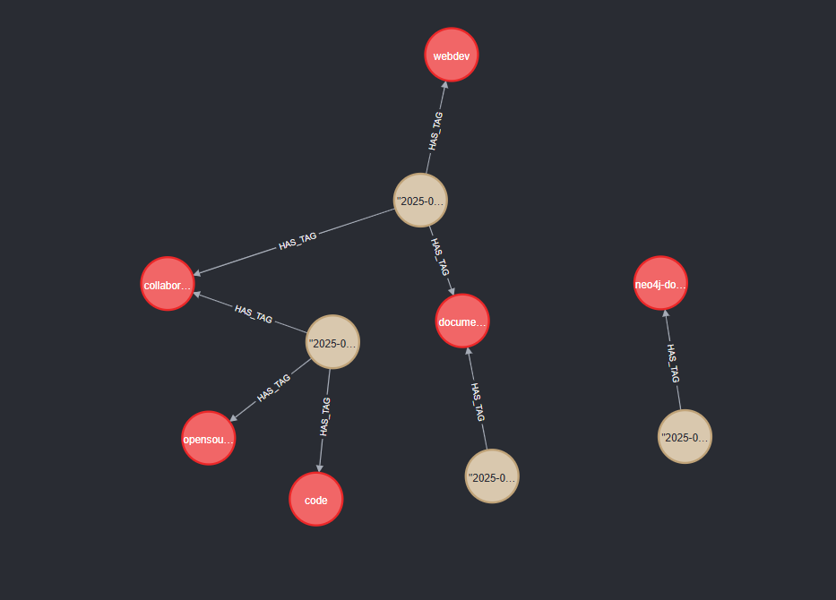

# Neo4j Lab

## Setup

1. Install dependencies: `composer install`
2. Start the Neo4j container: `make up`
3. Before populating the database, you need to access localhost:7474, login with default credentials (username: `neo4j`, password: `neo4j`) and change the password to `password`
4. Populate the database: `make populate` (only once!!!)
5. Access localhost:8080 to use the web interface

## Stopping the container

`make down`

## Usage

Example:

